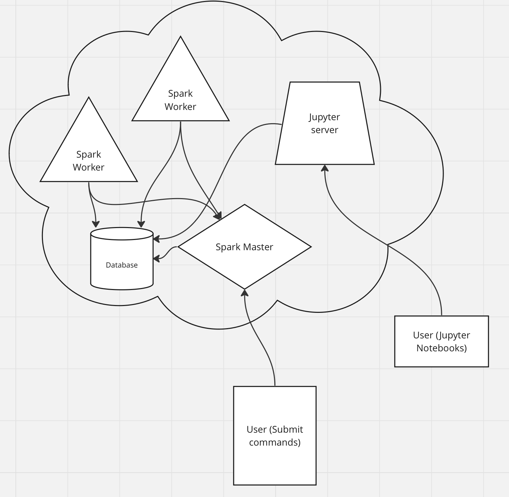

# Setup steps:

##### If using windows:
1. Install WSL2 (https://learn.microsoft.com/en-us/windows/wsl/install)
2. Install Docker Desktop(https://docs.docker.com/desktop/wsl/)
3. Continue to step 3 in general setup below

##### General Setup:
1. Install Docker(https://docs.docker.com/engine/install/)
2. Install Docker Compose(https://docs.docker.com/compose/install/)
3. You should have python 3.10 or higher installed
4. Install virtualenv if you don't already have it
5. run `virtualenv env`
6. run `source env/bin/activate`
7. run `pip install -r requirements/requirements.txt`
8. install make (not necessary, but makes life easier)
9. run `make build`
10. run `make run`
11. run `make submit app=gather_data.py`
12. run `make submit app=schema_create.py`
13. run `make submit app=ingest.py`

# Basic Architecture:

# Projects referenced:

- https://medium.com/@MarinAgli1/setting-up-a-spark-standalone-cluster-on-docker-in-layman-terms-8cbdc9fdd14b
- http://snap.stanford.edu/data/web-Amazon-links.html